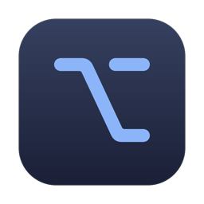

<p align="center">
  
</p>

<h1 align="center">Flow</h1>

<p align="center">
  <b>An AI-first flow operator for macOS.</b> Open source.<br>
  Windows tile into a 2×2 grid, work lives in flows you switch with ⌥1–9,<br>
  and every action is a command an agent can run.
</p>

<p align="center">
  <a href="https://github.com/yefimets/flow/releases/download/v0.1.2/Flow-0.1.2.zip"></a>
  
  
  <a href="LICENSE"></a>
</p>

---

**Latest release: [0.1.2](https://github.com/yefimets/flow/releases/tag/v0.1.2)** · [changelog](CHANGELOG.md) · [download Flow.zip](https://github.com/yefimets/flow/releases/latest/download/Flow-0.1.2.zip)

Flow treats your screen as a set of **flows**: a flow is one piece of work, with the two to four
windows it needs, laid out in a grid. You jump between flows with a number key. An AI agent can do the
same, because everything Flow does is also a command: create a flow, move a window into it, open a
browser or terminal there, focus, swap, screenshot every window of a flow. Ask Claude Code to "set up a
flow with the parking contract email and the Messages thread about it" and it can, without touching
your mouse.

It brings the Omarchy and Hyprland way of working to macOS, through the Accessibility API, with no
System Integrity Protection changes and no kernel tricks. One signed, notarized app, one ⌥ menu bar
icon, ⌥ for everything, MIT licensed.

## AI-first

Every keyboard action has a command twin, so an agent with a shell drives Flow exactly as you do:

```bash
flow cmd new                 # a fresh flow for the task at hand
flow cmd browser             # a browser window, tiled into it
flow cmd move 2              # move the focused window to flow 2 and follow it
flow cmd screenshot 2        # one PNG per window of flow 2, for the agent to read
flow cmd flow 1              # back to where you were
```

Commands go over a distributed notification to the running app, return instantly, and are logged, so
an agent can verify what happened in `~/Library/Logs/Flow.log`. Combined with window-level tools such as
Claude Code's computer use, that is enough to assemble a working context from email, chat and browser
windows, or to tidy a screen back into flows after a long session.

## Install

**Download** the latest `Flow.zip` from [Releases](https://github.com/yefimets/flow/releases/latest),
unzip, drag `Flow.app` to Applications and open it. It is signed with a Developer ID and notarized by
Apple, so there is no Gatekeeper warning.

On first launch macOS asks for **Accessibility** permission. Turn Flow on under System Settings ›
Privacy & Security › Accessibility. Flow notices within a second, splits the windows you already have
open into flows, two per flow side by side, and shows the shortcuts sheet once.

**Or build it** with Xcode's command line tools:

```bash
git clone https://github.com/yefimets/flow && cd flow
scripts/build.sh      # swift build + a stable code signature, so the Accessibility grant survives rebuilds
.build/release/flow
```

## What it does

- **2×2 grid.** At most two columns, at most two rows per column. New windows go side by side first,
  then under the focused window. A fifth window floats and takes the next free slot.
- **Flows.** Up to nine workspaces. Each has its own grid and floating windows. Switch with ⌥1–9, move
  a window and follow it with ⌥⇧1–9. The menu bar shows the active number.
- **Minimums respected, never clipped.** Chrome refuses to be narrower than about 626 px, Claude
  600 px, Notes 500 px tall. Flow learns each app's minimum from the first refusal and bends the grid
  around it. When two minimums cannot share a column, the least recently used window moves or floats.
- **Explicit beats automatic.** A window you place on purpose, with ⌥V, ⌥B, ⌥↩ or a flow move, only
  takes a slot where it fits; if nothing fits, the tile you touched longest ago floats to make room.
- **Mouse works too.** Drop a window on another tile to swap them. Drag an edge and the column or row
  boundary moves with it, so the neighbours follow.
- **Focus ring** around the active window, with corner radii matched per app and a colour picker in
  the menu.
- **Survives everything.** Lock, sleep, Space switches, app updates that relaunch during the night,
  and Flow's own restarts: every window returns to the flow and slot it had.
- **Menu bar app.** The ⌥ icon lists flows with their window counts, moves windows, picks the focus
  colour, and opens the shortcuts sheet.

## Keys

⌥ (Option) is the modifier for everything. Hold ⌥ on its own to peek at the shortcuts sheet, let go to hide it.

| Keys | Action |
| --- | --- |
| ⌥ 1 … 9 | Switch to that flow, creating it if it does not exist. Numbers need not be continuous |
| ⌥ ⇧ 1 … 9 | Move the focused window to that flow (created if needed), tile it there, and follow it |
| ⌥ N | New flow |
| ⌥ ⇧ W | Remove the current flow and close its windows |
| ⌥ ← ↓ ↑ → | Focus the window in that direction |
| ⌥ ← / ⌥ → | With nothing on that side: a window sharing a column breaks out into its own column there |
| ⌥ ⇧ ← ↓ ↑ → | Swap with the neighbour in that direction |
| ⌥ T | Move the window into the other column |
| ⌥ S | Swap the two columns |
| ⌥ ↩ | New terminal window, straight into the grid |
| ⌥ B | New default-browser window, straight into the grid |
| ⌥ W | Close the window |
| ⌥ F | Toggle fullscreen |
| ⌥ V | Toggle floating. New windows float; this tiles them |
| ⌥ = / ⌥ - | Widen / narrow the column |
| ⌥ ⇧ = / ⌥ ⇧ - | Grow / shrink the row |
| ⌥ / | Show or hide the shortcuts sheet |
| ⌥ ⇧ R | Reload the config file |
| ⌃ ⌥ Q | Quit Flow |

Mouse: drop a window onto another tile to swap them; drag a window edge to move the column or row
boundary; drop anywhere else and it snaps back.

## Flows

Flows are Flow's workspaces. macOS has no public API to hide a window, so windows of inactive flows are
parked in the bottom-right corner of the display with a 6 px sliver showing, the same technique
AeroSpace uses. Switching back restores tiles from the grid and floating windows to where they were.

Cmd-Tab to an app whose only window is on another flow follows it there. If the app also has a window
on the current flow, that one comes forward instead. Picking a specific window from the Dock, the
Window menu or Mission Control always follows it.

Removing a flow closes the windows in it. A window that stays open because its app asked about
unsaved changes moves to the nearest other flow instead, so nothing is stranded. Other flows keep their numbers.

## Configuration

`~/.config/flow/config.json`, every key optional:

```json
{
  "gapInner": 8,
  "gapOuter": 8,
  "borderWidth": 3,
  "borderRadius": 24,
  "borderInset": 2,
  "borderColor": "#7AA2F7",
  "borderRadii": { "com.google.Chrome": 18, "com.anthropic.claudefordesktop": 18 },
  "terminal": "auto",
  "resizeStep": 0.05,
  "newWindowsFloat": true,
  "optionHud": true,
  "floatApps": ["com.apple.systempreferences", "com.apple.finder"],
  "floatTitles": ["Preferences", "Settings", "Open", "Save", "Print", "Picker", "Alert"]
}
```

| Key | Meaning |
| --- | --- |
| `gapInner`, `gapOuter` | Pixels between tiles, and between tiles and the screen edge |
| `borderWidth`, `borderRadius`, `borderColor`, `borderInset` | The focus ring. `borderRadius` is for native windows; the ring is pulled in by `borderInset` to hug the visible edge |
| `borderRadii` | Ring corner radius per app bundle identifier. Chrome and Electron apps draw smaller corners than native macOS 26 windows |
| `terminal` | `"auto"` picks the first installed of Ghostty, Alacritty, kitty, WezTerm, iTerm, Terminal, or an app name |
| `resizeStep` | Fraction of the width or height moved per ⌥= / ⌥- press |
| `newWindowsFloat` | `true` floats windows opened after Flow starts, centred horizontally; ⌥V tiles one. `false` tiles them at once |
| `optionHud` | Holding ⌥ alone shows the shortcuts sheet |
| `floatApps` | Bundle identifiers that always float |
| `floatTitles` | Title substrings that float, applied only to windows smaller than 60% of the display |

Fixed-size windows, such as onboarding screens, are detected and float automatically. Edit the file and
press ⌥⇧R, or use the menu: focus colour and the ⌥ hold toggle are saved there for you.

Flow's own state, which window sits in which flow and slot, lives in `~/.config/flow/state.json` and is
restored on every launch. Delete it to get the first-run split again. Logs go to `~/Library/Logs/Flow.log`
when running as an app, or to the terminal.

## Scripting

All commands: `flow N`, `move N`, `new`, `remove`, `screenshot [N]`, `browser`, `terminal`,
`focus left|right|up|down`, `swap left|right|up|down`, `float`, `fullscreen`, `column`, `columns`,
`shortcuts`, `reload`, `quit`. Inside the app bundle the binary is `Flow.app/Contents/MacOS/flow`;
`screenshot` needs Screen Recording permission.

## How it works

- `AX.swift` wraps the Accessibility API: window frames, roles, resizability, the CGWindowID.
- `Layout.swift` is the grid: columns, rows, ratios, minimum sizes, eviction, and remembered column
  indices so windows come back to the same side after a Space switch.
- `WindowManager.swift` tracks apps and windows through AX notifications, decides what is eligible
  (standard, on the current Space, resizable, not minimised), applies layouts, runs the commands, and
  persists state. A reconcile pass every two seconds catches anything the notifications missed.
- `Hotkeys.swift` is a CGEvent tap that swallows the bound combos and watches the ⌥ hold.
- `Border.swift` is a click-through overlay that follows the focused window thirty times a second.
- `StatusMenu.swift` and `ShortcutsWindow.swift` are the menu bar item and the cheat sheet.

## Limitations

- macOS cannot hide windows, so parked windows keep a 6 px sliver in the corner.
- Apps with large minimum sizes cannot always share a column on a 13-inch screen; two browser windows
  end up side by side, each in its own column, rather than stacked.
- Flow manages the macOS Space in front. It works with several Desktops, but windows on another Desktop
  are picked up when that Desktop comes forward, so keeping everything on one Desktop and using flows is
  the smoother setup. Stage Manager fights with tilers; turn it off.
- Keybindings are fixed in code for now.

## Building the app bundle

```bash
scripts/make-app.sh          # build/Flow.app, signed with the best certificate in your keychain
scripts/notarize.sh          # notarize, staple, and produce build/Flow.zip (needs a Developer ID)
scripts/release.sh 0.2.0     # bump the version, build, notarize, tag, and publish a GitHub release
```

Notarization needs a one-time `xcrun notarytool store-credentials flow-notary --apple-id … --team-id …`.

## License

MIT. Brand marks on the shortcuts sheet are from [Simple Icons](https://simpleicons.org) (CC0).
